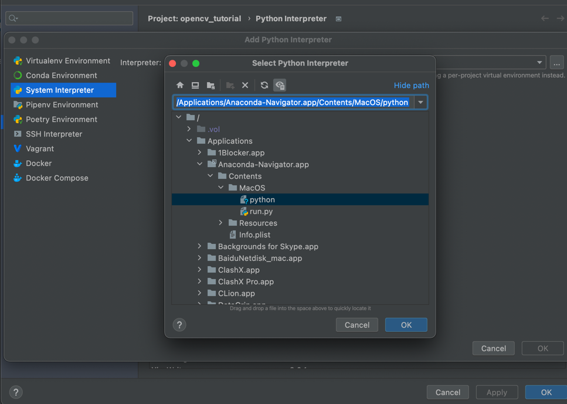
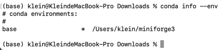
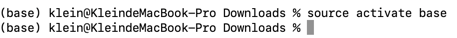
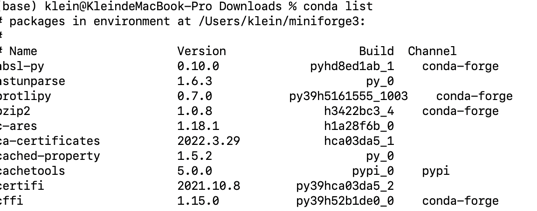

# opencv_tutorial
# 1. install anaconda [https://www.anaconda.com/products/distribution]

# 1.1 use your anaconda in pycharm.
Preferences - Python interpreter - System Interpreter - anaconda3 - python.app - python - 点击OK


# 1.2 update the pip source and install opencv
```shell
pip install opencv-python -i https://pypi.mirrors.ustc.edu.cn/simple/ 
pip install opencv-contrib-python -i https://pypi.mirrors.ustc.edu.cn/simple/ 

pip install XXX -i 地址
阿里云 http://mirrors.aliyun.com/pypi/simple/ 
中国科技大学 https://pypi.mirrors.ustc.edu.cn/simple/ 
豆瓣(douban) http://pypi.douban.com/simple/ 
清华大学 https://pypi.tuna.tsinghua.edu.cn/simple/ 
中国科学技术大学 http://pypi.mirrors.ustc.edu.cn/simple/
阿里云 http://mirrors.aliyun.com/pypi/simple/ 
中国科技大学 https://pypi.mirrors.ustc.edu.cn/simple/ 
豆瓣(douban) http://pypi.douban.com/simple/ 
清华大学 https://pypi.tuna.tsinghua.edu.cn/simple/ 
中国科学技术大学 http://pypi.mirrors.ustc.edu.cn/simple/
```

# 1.3 check your opencv
```pycon
import cv2
cv2.__version__
```

#1.4 update tensflow for Apple M1 chip
```shell
/Users/klein/miniforge3/condabin/conda install -c apple tensorflow-deps

/Users/klein/miniforge3/condabin/conda install -c apple tensorflow-deps --force-reinstall

/Users/klein/miniforge3/condabin/conda install -c apple tensorflow-deps --force-reinstall -n my_env


conda install -c apple tensorflow-deps
python -m pip install tensorflow-macos -i https://pypi.mirrors.ustc.edu.cn/simple/
python -m pip install tensorflow-metal -i https://pypi.mirrors.ustc.edu.cn/simple/

```

#1.5 查看conda环境
```shell
conda info --env
```


#1.5.1 进入环境
```shell
source activate base
```

#1.5.2 查看conda安装了哪些库
```shell
conda list
```
